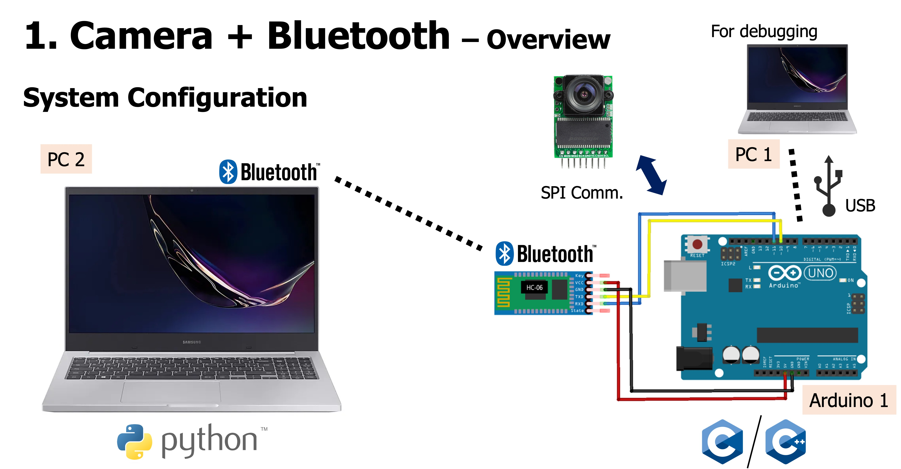
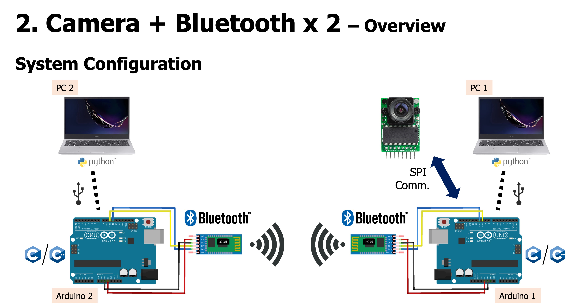
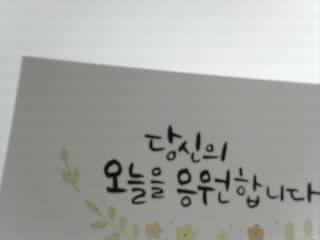

# [HYU-AUE3034] Microprocessor Application System
## Lab 09: Camera + Bluetooth

### Configurations

### Bluetooth settings
- (Slave)
  0. Compile & upload `./arduino2/ardu2_bluetooth.ino`
  1. `AT+ORGL`: factory reset
  2. `AT+ADDR`: get MAC address of the bluetooth module -> `{SLAVE_MAC_ADDR}`
  3. `AT+RESET`: reboot to quit AT command mode

- (Master)
  0. Compile & upload `./arduino2/ardu2_bluetooth.ino`
  1. `AT+ORGL`: factory reset
  2. `AT+ROLE=1`: set this module as master
  3. `AT+BIND={SLAVE_MAC_ADDR}`: bind to the slave module, e.g., `98d3,b1,fd64fc`
  4. `AT+RESET`: reboot to quit AT command mode

### Arduino 1
- Compile & upload `./arduino1/ardu1_camera_and_bluetooth.ino`
  - Set camera (OV2640 or OV5642)
  - Request an image via serial communication
  - Receive the image data via SPI communication
  - Send the image data via bluetooth (software serial)

### Arduino 2 (Configuration 2 only)
- Compile & upload `./arduino2/ardu2_bluetooth.ino`

### PC 2
- Open `./pc2/receive_image.ipynb` (VS Code)
- Run cells in the jupyter notebook (`receive_image.ipynb`)
- Finally, you'll see an image like this!

